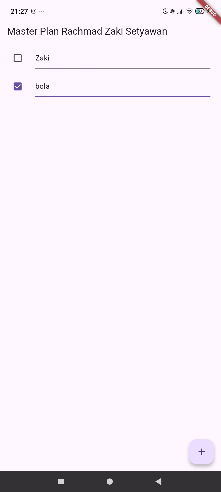

# Pertemuan 10 — Master Plan (Dasar State dengan Model-View)

Rachmad Zaki Setyawan  
244107060107  
SIB 2D

## Praktikum 1 — Dasar State dengan Model-View

### Langkah 1: Buat Project Baru
Buat project flutter baru dengan nama `master_plan`. Lalu buat susunan folder `models` dan `views` di dalam folder `lib` supaya kode kita terorganisir — model buat data, views buat tampilan.

### Langkah 2: Membuat model task.dart
Buat file `task.dart` di folder `models`. Class `Task` ini nyimpen data satu tugas — punya `description` (deskripsi tugas) dan `complete` (sudah selesai atau belum). Dua-duanya `final` dan punya nilai default (string kosong dan false).

### Langkah 3: Buat file plan.dart
Buat file `plan.dart` di folder `models`. Class `Plan` ini nyimpen satu rencana yang punya `name` (nama rencana) dan `tasks` (daftar tugas berupa List of Task). Ini yang jadi "wadah" utama data di aplikasi kita.

### Langkah 4: Buat file data_layer.dart
Buat file `data_layer.dart` di folder `models` yang isinya cuma export `plan.dart` dan `task.dart`. Ini namanya barrel file — fungsinya biar kita cukup import satu file ini aja kalau mau pake model Plan dan Task, gak perlu import satu-satu.

### Langkah 5: Pindah ke file main.dart
Ubah isi `main.dart` — bikin class `MasterPlanApp` dengan `MaterialApp` bertema ungu, dan set `PlanScreen` sebagai halaman utama.

### Langkah 6: Buat plan_screen.dart
Buat file `plan_screen.dart` di folder `views`. Ini halaman utama app — pakai `StatefulWidget` karena ada data yang berubah-ubah. Variabel `plan` nyimpen state rencana saat ini, di-init sebagai `const Plan()` (kosong). Di `build()` ada AppBar, body berupa list, dan FloatingActionButton buat tambah task.

### Langkah 7: Buat method _buildAddTaskButton()
Bikin method buat tombol tambah task (FAB dengan ikon `+`). Pas ditekan, `setState()` dipanggil dan bikin objek Plan baru yang isinya task lama + 1 task kosong baru di akhir list.

### Langkah 8: Buat widget _buildList()
Bikin method yang return `ListView.builder` — list yang bisa di-scroll dan bikin item secara dinamis sesuai jumlah task. Setiap item manggil `_buildTaskTile()`.

### Langkah 9: Buat widget _buildTaskTile
Bikin method buat nampilin setiap task sebagai `ListTile`. Ada `Checkbox` di kiri buat centang selesai/belum, dan `TextFormField` buat ngetik deskripsi. Pas user centang atau ngetik, `setState()` dipanggil biar data dan tampilan langsung ke-update.

### Langkah 10: Tambah Scroll Controller
Tambahkan variabel `ScrollController` di class State. Ini buat ngontrol perilaku scroll pada ListView, terutama buat handle keyboard yang menghalangi input di bagian bawah list.

### Langkah 11: Tambah Scroll Listener
Tambahkan `initState()` dan pasang listener di `ScrollController`. Listener ini bikin keyboard otomatis nutup pas user scroll — caranya dengan menghapus focus dari semua TextField lewat `FocusScope.of(context).requestFocus(FocusNode())`.

### Langkah 12: Tambah controller dan keyboard behavior
Pasangkan `scrollController` ke `ListView.builder` dan tambahkan `keyboardDismissBehavior` supaya di iOS keyboard bisa nutup pas di-drag. Di Android tetap pakai mode manual.

### Langkah 13: Tambah method dispose()
Tambahkan `dispose()` yang manggil `scrollController.dispose()`. Ini wajib buat bersihin resource ScrollController pas widget dihapus, biar gak terjadi memory leak.

### Langkah 14: Hasil

App to-do list udah jalan lengkap — bisa tambah task, edit deskripsi, centang selesai, scroll, dan keyboard otomatis nutup pas scroll.

## Soal Praktikum 1

### 1. Jelaskan maksud dari langkah 4 pada praktikum tersebut! Mengapa dilakukan demikian?

Langkah 4 itu bikin file `data_layer.dart` yang isinya cuma `export 'plan.dart'` dan `export 'task.dart'`. Fungsinya sebagai "pintu masuk" buat semua model — jadi pas mau import model Plan atau Task, cukup import satu file ini aja gak perlu import satu-satu. Lebih rapi dan kalau nanti nambah model baru tinggal tambahin export di satu tempat.

### 2. Mengapa perlu variabel `plan` di langkah 6? Mengapa dibuat konstanta?

Variabel `plan` itu state utama dari halaman — nyimpen semua data rencana dan daftar tugas yang ditampilin di layar. Tiap ada perubahan (tambah task, edit, centang), variabel ini di-update lewat `setState()` biar UI ikut berubah.

Dibuat `const` karena nilai awalnya itu objek Plan kosong (belum ada task). Pakai `const` bikin Dart lebih hemat memori karena objek kosong itu cuma dibuat sekali pas compile dan bisa di-reuse.

### 3. Capture hasil dari Langkah 9 berupa GIF, jelaskan apa yang telah dibuat!

Di langkah 9, kita bikin method `_buildTaskTile()` yang nampilin setiap task sebagai `ListTile`. Di dalamnya ada `Checkbox` buat centang task selesai/belum, dan `TextFormField` buat ngetik deskripsi task. Pas user centang atau ngetik, `setState()` dipanggil biar data dan tampilan langsung ke-update. Dengan langkah ini, app udah bisa tambah task, edit deskripsi, dan tandai selesai.

### 4. Apa kegunaan method pada Langkah 11 dan 13 dalam lifecycle state?

**Langkah 11 — `initState()`:** Method ini dipanggil sekali pas widget pertama kali dibuat. Di sini kita inisialisasi `ScrollController` dan pasang listener yang bikin keyboard otomatis nutup pas user scroll. `initState()` tempat yang tepat buat setup controller karena cuma perlu dilakukan sekali di awal.

**Langkah 13 — `dispose()`:** Method ini dipanggil sekali pas widget dihapus permanen dari layar. Di sini kita panggil `scrollController.dispose()` buat bersihin resource dan listener yang udah gak dipake. Kalau gak di-dispose, bakal terjadi memory leak — controller tetap nempel di memori padahal widget-nya udah gak ada.

Intinya: apa yang dibuat di `initState()` harus dibersihkan di `dispose()`.

---

## Praktikum 2 — InheritedWidget

### Langkah 1: Buat file plan_provider.dart
Buat folder `provider` di dalam `lib`, lalu buat file `plan_provider.dart`. Di sini kita bikin class `PlanProvider` yang extends `InheritedNotifier`. Fungsinya sebagai "penyedia data" — supaya data `Plan` bisa diakses dari widget mana aja tanpa perlu passing data lewat constructor satu-satu. Method `of(context)` dipake buat ambil data Plan dari mana aja di widget tree.

### Langkah 2: Edit main.dart
Bungkus `PlanScreen` dengan `PlanProvider` di `main.dart`. Ini bikin `PlanProvider` jadi "pembungkus" yang nyimpen data Plan dan bisa diakses oleh semua widget di bawahnya. `ValueNotifier<Plan>` dipake biar setiap kali data Plan berubah, widget yang dengerin otomatis ke-rebuild.

### Langkah 3: Tambah method pada model plan.dart
Tambahkan dua method baru di class `Plan`: `completedCount` buat ngitung berapa task yang udah selesai, dan `completenessMessage` buat bikin teks "X out of Y tasks". Method ini nanti dipake buat nampilin progress di bagian bawah layar.

### Langkah 4: Pindah ke PlanScreen
Hapus deklarasi variabel `plan` yang lama di `PlanScreen`. Ini bakal bikin error dulu, tapi gak apa-apa — kita ganti sumber datanya dari variabel lokal ke `PlanProvider` di langkah selanjutnya.

### Langkah 5: Edit method _buildAddTaskButton
Update method `_buildAddTaskButton` supaya ambil data dari `PlanProvider` (bukan dari variabel lokal). Sekarang pas tombol `+` ditekan, task baru ditambahkan lewat `PlanProvider` — jadi semua widget yang dengerin data ini otomatis ke-update.

### Langkah 6: Edit method _buildTaskTile
Sama kayak langkah 5, update `_buildTaskTile` supaya ambil dan update data lewat `PlanProvider`. Checkbox dan TextFormField sekarang baca dan tulis data lewat provider. Juga ganti `TextField` jadi `TextFormField` biar lebih gampang set nilai awal (`initialValue`).

### Langkah 7: Edit _buildList
Sesuaikan parameter `_buildTaskTile` supaya nerima `context` — karena sekarang method itu butuh context buat akses `PlanProvider`.

### Langkah 8: Tetap di class PlanScreen
Bungkus `_buildList` dengan `Expanded` dan masukin ke `Column`. Ini buat nyiapin tempat di bagian bawah layar supaya bisa nampilin progress task.

### Langkah 9: Tambah widget SafeArea
Tambahkan `SafeArea` dengan `completenessMessage` di bawah list. Sekarang di bagian bawah layar ada teks yang nampilin progress, misal "3 out of 5 tasks". Dibungkus `ValueListenableBuilder` biar otomatis update tiap data berubah.

)

### Soal Praktikum 2

### 1. Jelaskan mana yang dimaksud InheritedWidget pada langkah 1! Mengapa yang digunakan InheritedNotifier?

`PlanProvider` itu InheritedWidget-nya — dia extends `InheritedNotifier` yang merupakan subclass dari `InheritedWidget`. InheritedWidget itu widget khusus di Flutter yang bisa "mewariskan" data ke semua widget di bawahnya tanpa perlu passing lewat constructor.

Yang dipake `InheritedNotifier` (bukan `InheritedWidget` biasa) karena `InheritedNotifier` punya fitur tambahan: dia bisa dengerin perubahan dari `Notifier` (dalam hal ini `ValueNotifier<Plan>`). Jadi setiap kali data Plan berubah, semua widget yang bergantung pada provider ini otomatis di-rebuild. Kalau pakai `InheritedWidget` biasa, kita harus handle notifikasi perubahannya sendiri secara manual.

### 2. Jelaskan maksud dari method di langkah 3! Mengapa dilakukan demikian?

`completedCount` — Menghitung jumlah task yang udah dicentang (complete = true) pakai method `where()` yang nyaring task berdasarkan kondisi.

`completenessMessage` — Bikin string "X out of Y tasks" buat ditampilin sebagai progress di layar.

Dibuat karena kita butuh nampilin info progress di bagian bawah layar (langkah 9). Daripada nulis logika hitung-hitungan di UI, lebih rapi kalau ditaruh di model. Ini sesuai prinsip Model-View — model yang ngurus data dan logika, view tinggal nampilin aja.

### 3. Capture hasil dari Langkah 9 berupa GIF, jelaskan apa yang telah dibuat!

)

Di langkah 9, app sekarang nampilin progress di bagian bawah layar — misal "3 out of 5 tasks". Ini pakai `ValueListenableBuilder` yang dengerin perubahan dari `PlanProvider`, jadi setiap kali user centang task atau tambah task baru, teks progress otomatis ke-update. Widget `SafeArea` dipake biar teks gak ketutupan navigation bar HP.

---

## Praktikum 3 — State di Multiple Screens

### Langkah 1: Edit PlanProvider
Update `PlanProvider` supaya handle `List<Plan>` (banyak plan), bukan cuma satu `Plan`. Sekarang `ValueNotifier` nyimpen list of plan, jadi app bisa punya banyak rencana sekaligus.

### Langkah 2: Edit main.dart
Update `main.dart` — `PlanProvider` sekarang dibungkus di luar `MaterialApp` (bukan di dalam `home`), dan notifier-nya diisi list kosong `[]`. Ini biar provider bisa diakses dari semua halaman termasuk halaman baru yang nanti di-push.

### Langkah 3: Edit plan_screen.dart
Tambahkan parameter `plan` di constructor `PlanScreen`. Sekarang `PlanScreen` nerima satu `Plan` spesifik yang mau ditampilin, bukan nyimpen sendiri datanya.

### Langkah 4: Error
Setelah langkah 3, pasti error karena `PlanProvider.of(context)` sekarang return `List<Plan>` bukan satu `Plan`. Ini expected — kita fix di langkah-langkah selanjutnya.

### Langkah 5: Tambah getter Plan
Tambahkan getter `plan` yang ngambil data dari `widget.plan`. Ini biar method-method di bawahnya bisa akses plan yang diterima dari constructor tanpa nulis `widget.plan` terus-terusan.

### Langkah 6: Method initState()
`initState()` tetap sama kayak sebelumnya — inisialisasi `ScrollController` dengan listener buat nutup keyboard pas scroll.

### Langkah 7: Widget build
Update method `build` supaya pakai `List<Plan>` dari provider. Cari plan yang sesuai pakai `firstWhere()` berdasarkan nama. AppBar sekarang nampilin nama plan, bukan teks statis.

### Langkah 8: Edit _buildTaskTile
Update `_buildAddTaskButton` dan `_buildTaskTile` supaya update data di dalam list plan (bukan satu plan). Cari index plan yang sesuai, lalu update task di index tersebut.

### Langkah 9: Buat screen baru
Buat file `plan_creator_screen.dart` di folder `views`. Ini halaman baru yang jadi halaman utama — buat bikin plan-plan baru. Ganti `home` di `main.dart` jadi `PlanCreatorScreen`.

### Langkah 10: Tambah TextEditingController
Tambahkan `TextEditingController` buat handle input teks nama plan baru. Jangan lupa dispose di `dispose()` biar gak memory leak.

### Langkah 11: Method build PlanCreatorScreen
Bikin tampilan dengan AppBar, `TextField` di atas buat input nama plan, dan list plan di bawahnya. Pakai `Column` dengan `Expanded` biar list plan isi sisa layar.

### Langkah 12: Widget _buildListCreator
Bikin widget `TextField` dengan elevation (bayangan) biar keliatan kayak card. User ketik nama plan, tekan enter, plan baru langsung ditambahkan.

### Langkah 13: Void addPlan()
Method buat tambah plan baru ke list. Ambil teks dari controller, bikin objek `Plan` baru, tambahin ke list di provider, clear textfield, dan tutup keyboard.

### Langkah 14: Widget _buildMasterPlans()
Bikin list semua plan yang udah dibuat. Kalau belum ada plan, tampilin ikon dan teks "Anda belum memiliki rencana apapun." Kalau udah ada, tampilin sebagai `ListTile` dengan nama plan dan progress-nya. Pas di-tap, navigasi ke `PlanScreen` buat ngelola task di plan tersebut.

)

### Soal Praktikum 3

### 1. Berdasarkan Praktikum 3, jelaskan maksud dari gambar diagram berikut!

Diagram kiri menunjukkan struktur widget di halaman `PlanCreatorScreen` — `MaterialApp` bungkus `PlanProvider`, yang di dalamnya ada `PlanCreatorScreen` berisi `Column` dengan `TextField` (buat input nama plan baru) dan `Expanded` berisi `ListView` (daftar plan yang udah dibuat).

Diagram kanan menunjukkan struktur widget di halaman `PlanScreen` setelah user tap salah satu plan — navigasi pakai `Navigator.push`. Di `PlanScreen` ada `Scaffold` berisi `Column` dengan `Expanded` (berisi `ListView` daftar task) dan `SafeArea` (berisi `Text` progress).

Intinya: app punya dua layar yang saling terhubung lewat `Navigator`, dan keduanya akses data yang sama lewat `PlanProvider` yang dibungkus di level paling atas (`MaterialApp`).

### 2. Capture hasil dari Langkah 14 berupa GIF, jelaskan apa yang telah dibuat!

)
)

App sekarang support multiple plans. Di layar pertama (`PlanCreatorScreen`), user bisa bikin plan baru dengan ketik nama dan enter. Semua plan yang udah dibuat keliatan di list beserta progress-nya. Pas tap salah satu plan, masuk ke `PlanScreen` yang nampilin daftar task khusus buat plan itu. Semua data tersinkronisasi lewat `PlanProvider` — jadi pas balik ke layar pertama, progress otomatis ke-update.

### Bug Fix: Task cuma bisa ditambah sekali

Saat pertama kali dijalankan, ada bug di mana task cuma bisa ditambah satu kali. Setelah itu tombol `+` gak nambah task lagi — harus keluar dari halaman dulu baru bisa nambah lagi.

**Penyebabnya:** di method `_buildAddTaskButton` dan `_buildTaskTile`, kode asli menulis `Plan currentPlan = plan` yang baca dari `widget.plan`. Masalahnya, `widget.plan` itu nilainya gak pernah berubah — dia cuma nyimpen data plan yang pertama kali dikirim dari `PlanCreatorScreen`. Jadi walaupun kita udah nambah task lewat provider, `widget.plan` tetap nunjuk ke plan lama (yang task-nya masih kosong/sedikit).

**Solusinya:** ganti baca plan dari provider langsung, bukan dari `widget.plan`. Caranya cari index plan di provider berdasarkan nama (`plan.name` dari widget cuma dipake sebagai "kunci" buat nyari), lalu ambil data plan terkini dari `planNotifier.value[planIndex]`. Dengan begitu setiap kali tombol `+` ditekan, dia baca data task terbaru dan nambah task di atas data yang udah ada.
