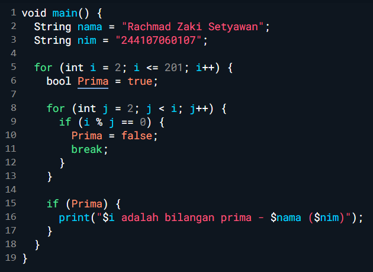
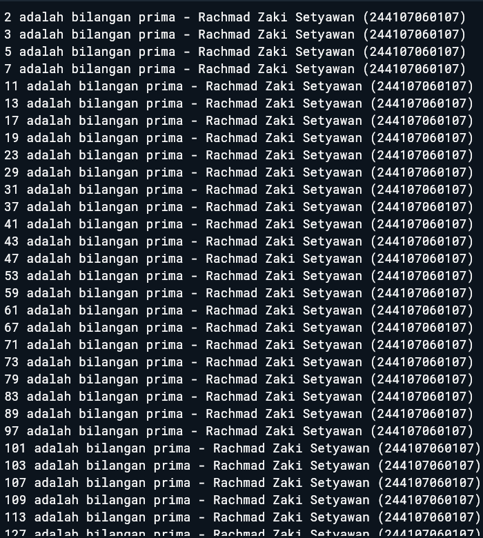

# Laporan Praktikum #03 - Bahasa Pemrograman Dart - Bagian 2

## Identitas Mahasiswa

| Atribut | Nilai                        |
| ------- | -----                        |
| Nama    | Rachmad Zaki Setyawan        |
| NIM     | 244107060107                 |
| Kelas   | SIB-2D                       |

---

## Tugas Praktikum 

### Soal 1

1. Silakan selesaikan Praktikum 1 sampai 3, lalu dokumentasikan berupa screenshot hasil pekerjaan beserta penjelasannya!

Jawab:

#### - Praktikum 1 

- Langkah 1

Ketik atau salin kode program berikut ke dalam fungsi main().

- Langkah 2

Silakan coba eksekusi (Run) kode pada langkah 1 tersebut. Apa yang terjadi? Jelaskan!
Jawab

Kode yang kamu tulis error karena penulisan keyword if dan else di Dart harus huruf kecil semua. Bahasa Dart case-sensitive (membedakan huruf besar dan kecil). Error yang muncul dapat dilihat pada hasil berikut.

- Langkah 3

Apa yang terjadi ? Jika terjadi error, silakan perbaiki namun tetap menggunakan if/else.
Jawab

Program mengalami error karena variabel test dideklarasikan dua kali dalam satu scope yang sama dan kondisi if (test) menggunakan tipe data String, padahal pernyataan if di Dart hanya dapat menggunakan nilai bertipe boolean (true atau false).

Perbaikannya adalah tidak mendeklarasikan variabel test dua kali dalam satu scope dan mengganti kondisi if agar menggunakan tipe data boolean (bool), bukan String.

#### - Praktikum 2

- Langkah 1

Ketik atau salin kode program berikut ke dalam fungsi main().

- Langkah 2

Silakan coba eksekusi (Run) kode pada langkah 1 tersebut. Apa yang terjadi? Jelaskan! Lalu perbaiki jika terjadi error.
Jawab

Saat kode dijalankan akan terjadi error karena variabel counter dipakai di dalam perulangan while, tetapi variabel tersebut belum dibuat atau belum diberi nilai awal, sehingga Dart tidak mengetahui nilai dari counter.

Perbaikannya adalah mendeklarasikan variabel counter terlebih dahulu dan memberi nilai awal sebelum digunakan pada perulangan.

Setelah diperbaiki, program akan menampilkan angka 0 sampai 32 karena perulangan akan terus berjalan selama nilai counter masih kurang dari 33 dan setiap perulangan nilai counter akan bertambah 1.

- Langkah 3

Tambahkan kode program berikut, lalu coba eksekusi (Run) kode Anda.

Jawab

Ketika kode dijalankan tidak terjadi error. Program akan menjalankan perulangan while terlebih dahulu yang menampilkan nilai counter dari 0 sampai 32 karena kondisi yang digunakan adalah counter < 33. Setelah perulangan tersebut selesai, nilai counter menjadi 33. 

Kemudian program menjalankan perulangan do-while yang akan mencetak nilai counter dari 33 sampai 76, karena kondisi perulangannya adalah counter < 77. Perulangan do-while akan terus berjalan selama kondisi masih terpenuhi dan nilai counter selalu bertambah 1 setiap iterasi.

#### - Praktikum 3

- Langkah 1

Ketik atau salin kode program berikut ke dalam fungsi main().

- Langkah 2

Silakan coba eksekusi (Run) kode pada langkah 1 tersebut. Apa yang terjadi? Jelaskan! Lalu perbaiki jika terjadi error.
Jawab

Saat kode dijalankan akan terjadi error karena variabel index belum dideklarasikan, penulisan Index dan index tidak konsisten (Dart bersifat case-sensitive), serta pada bagian increment tidak menggunakan index++.

Perbaikannya adalah mendeklarasikan variabel index, menggunakan penulisan yang konsisten, dan menambahkan increment pada perulangan for.

Setelah diperbaiki, program akan menampilkan angka 10 sampai 26 karena perulangan akan berjalan selama nilai index masih kurang dari 27 dan setiap iterasi nilai index akan bertambah 1.

- Langkah 3

Tambahkan kode program berikut di dalam for-loop, lalu coba eksekusi (Run) kode Anda.

Jawab

Saat kode dijalankan akan terjadi error karena penulisan If dan Else If harus menggunakan huruf kecil (if dan else if), variabel Index dan index tidak konsisten karena Dart case-sensitive, serta kondisi if berada di luar perulangan for sehingga variabel index tidak dapat diakses.

Perbaikannya adalah menuliskan if dan else if dengan huruf kecil, menggunakan nama variabel yang sama yaitu index, dan menempatkan kondisi tersebut di dalam perulangan for.

Setelah diperbaiki, program akan melakukan perulangan dari 10 sampai sebelum 27, namun ketika nilai index = 21 perulangan akan berhenti (break). Perintah continue digunakan untuk melewati iterasi tertentu tanpa menjalankan print, meskipun pada rentang ini kondisi tersebut tidak terpenuhi.

### Soal 2

Buatlah sebuah program yang dapat menampilkan bilangan prima dari angka 0 sampai 201 menggunakan Dart. Ketika bilangan prima ditemukan, maka tampilkan nama lengkap dan NIM Anda.

Jawab

Kodingan

Output

Program melakukan perulangan dari 2 sampai 201.
Setiap angka dicek apakah habis dibagi oleh angka lain selain 1 dan dirinya sendiri. Jika tidak habis dibagi, maka angka tersebut adalah bilangan prima, lalu program akan menampilkan angka tersebut beserta nama dan NIM.
