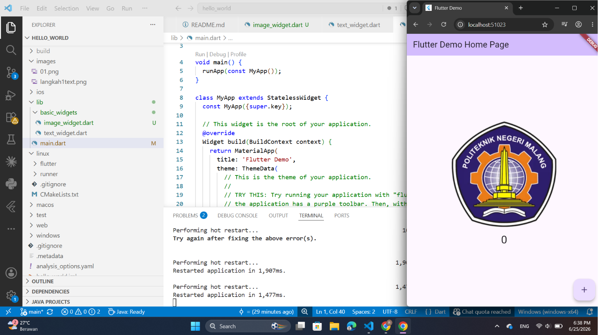
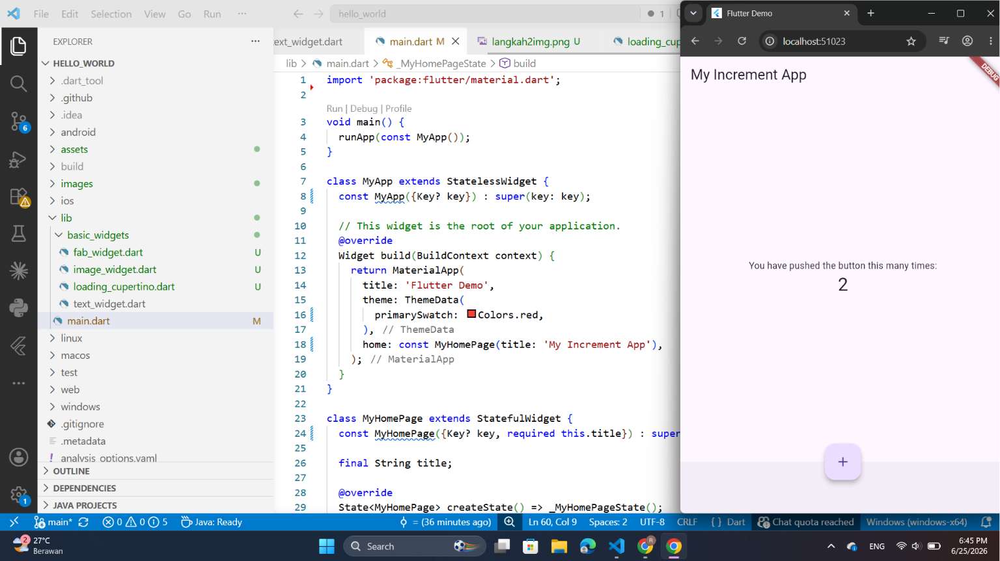
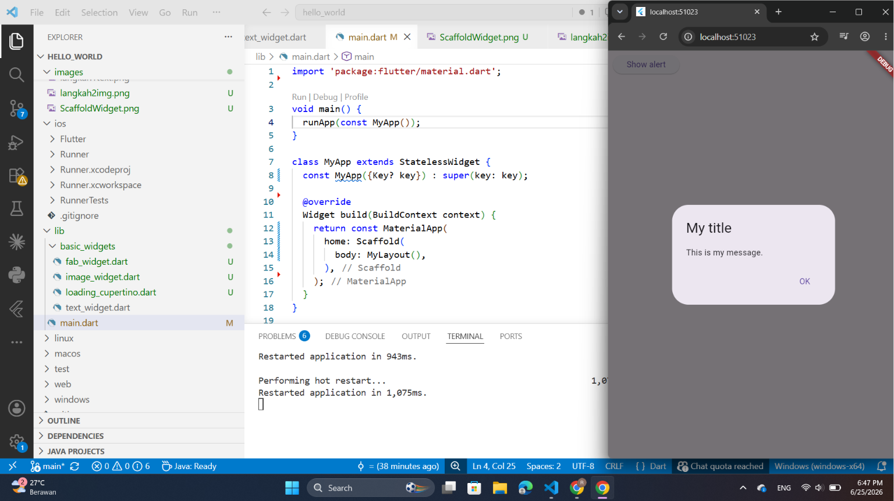
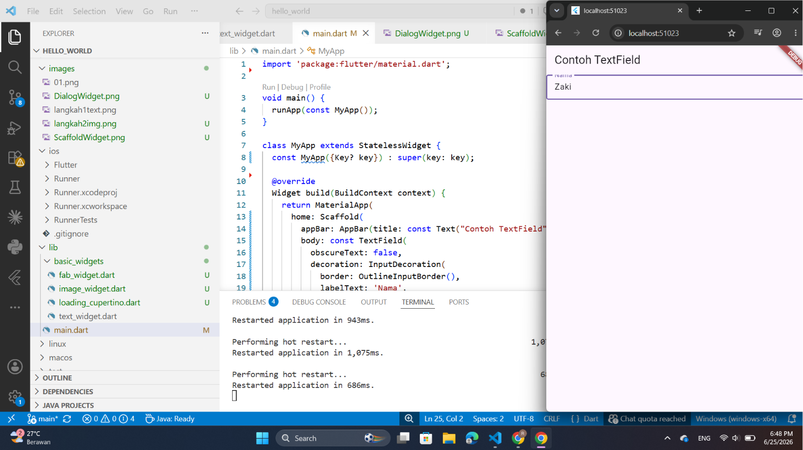
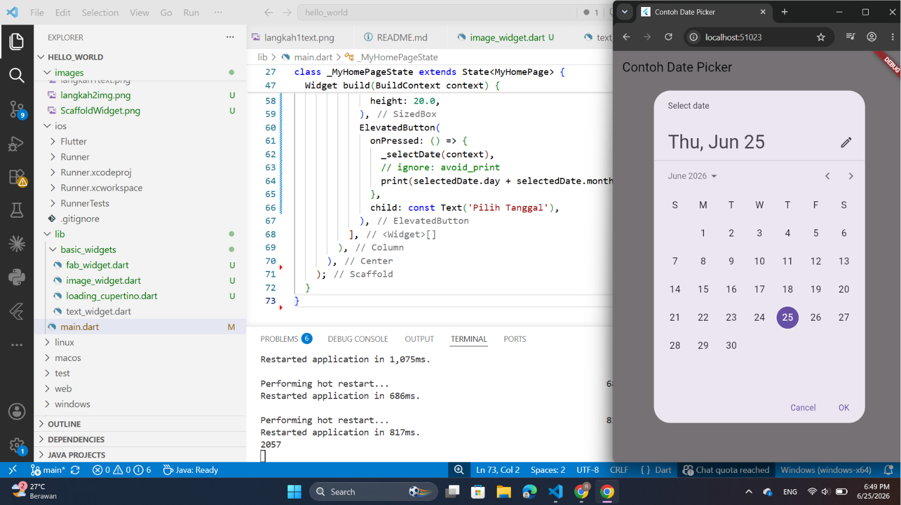

# hello_world

A new Flutter project.

## Langkah 1: Text Widget
Menambahkan Basic Widget

## Langkah 2: Image Widget
Menambahkan Basic Widget

## Langkah 3: loading_cupertino.dart

import 'package:flutter/material.dart';
import 'package:flutter/cupertino.dart';

class LoadingCupertino extends StatelessWidget {
  const LoadingCupertino({super.key});

  @override
  Widget build(BuildContext context) {
    return MaterialApp(
      home: Container(
        margin: const EdgeInsets.only(top: 30),
        color: Colors.white,
        child: Column(
          children: <Widget>[
            CupertinoButton(
              child: const Text("Contoh button"),
              onPressed: () {},
            ),
            const CupertinoActivityIndicator(),
          ],
        ),
      ),
    );
  }
}

## Langkah 4: Floating Action Button (FAB)

import 'package:flutter/material.dart';

class LoadingCupertino extends StatelessWidget {
  const LoadingCupertino({super.key});

  @override
  Widget build(BuildContext context) {
  return MaterialApp(
      home: Scaffold(
        floatingActionButton: FloatingActionButton(
          onPressed: () {
            // Add your onPressed code here!
          },
          child: const Icon(Icons.thumb_up),
          backgroundColor: Colors.pink,
        ),
      ),
    );
  }
}

## Langkah 5: Scaffold Widget
    Scaffold widget digunakan untuk mengatur tata letak sesuai dengan material design.
    

## Langkah 4: Dialog Widget
    Dialog widget pada flutter memiliki dua jenis dialog yaitu AlertDialog dan SimpleDialog
    

## Langkah 4: Input dan Selection Widget
    Flutter menyediakan widget yang dapat menerima input dari pengguna aplikasi yaitu antara lain Checkbox, Date and Time Pickers, Radio Button, Slider, Switch, TextField.
    

## Langkah 4: Date and Time Pickers
    Date and Time Pickers termasuk pada kategori input dan selection widget, berikut adalah contoh penggunaan Date and Time Pickers.
    