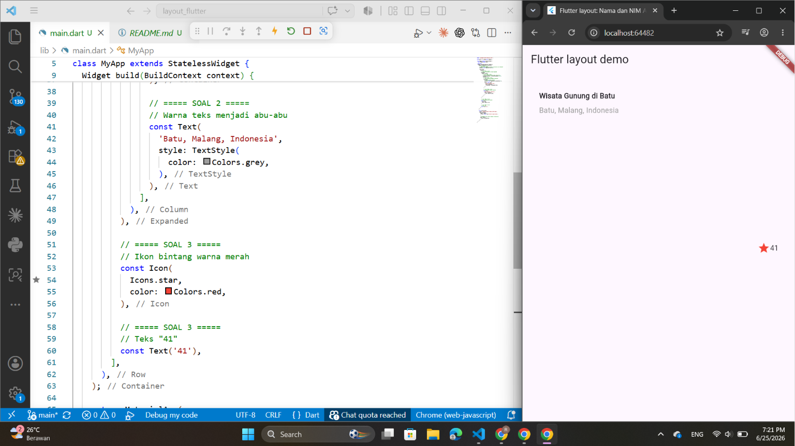
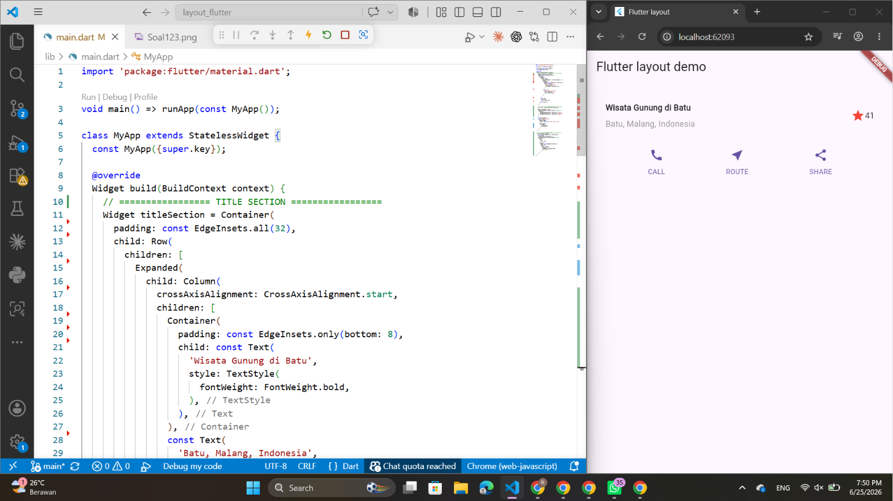
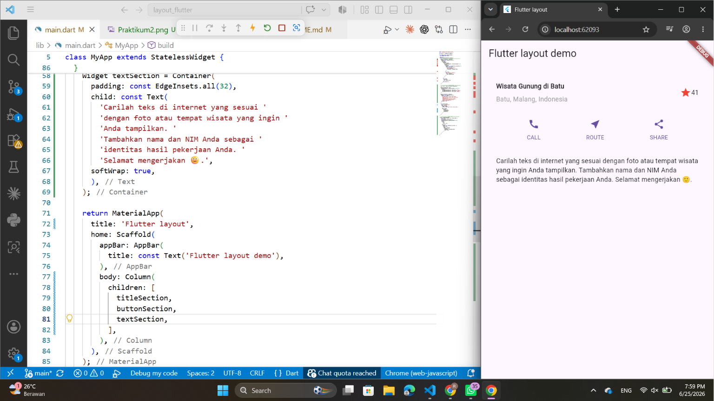
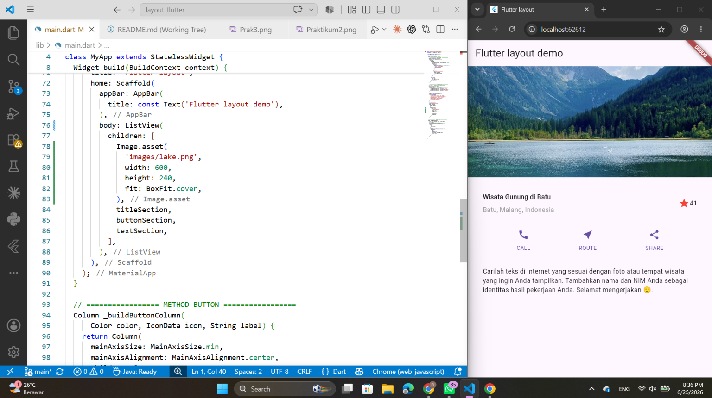
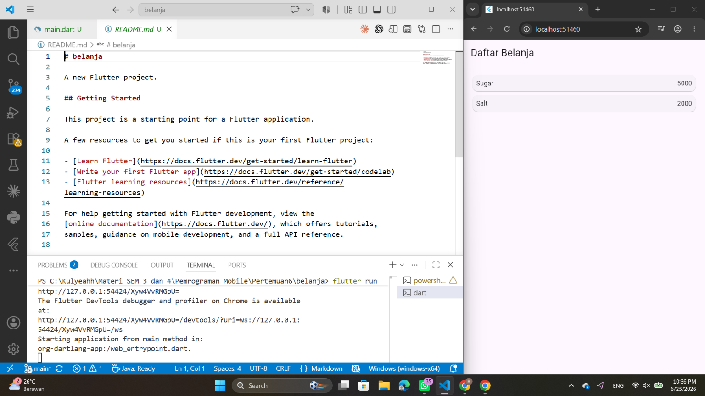
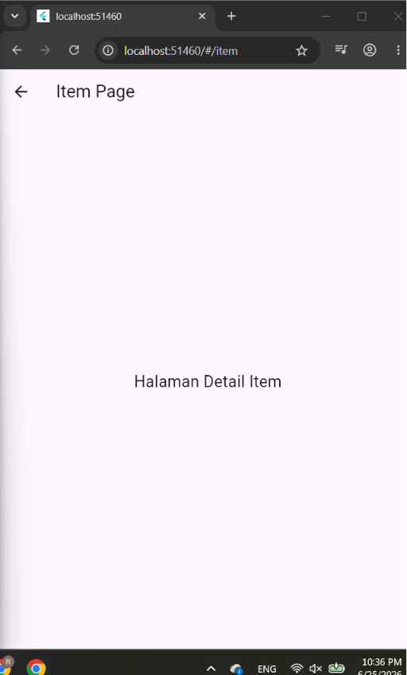

# layout_flutter

A new Flutter project.

## Praktikum 1

import 'package:flutter/material.dart';

void main() => runApp(const MyApp());

class MyApp extends StatelessWidget {
  const MyApp({super.key});

  @override
  Widget build(BuildContext context) {
    Widget titleSection = Container(
      // ===== SOAL 3 =====
      // Memberikan padding 32 piksel di seluruh sisi Container
      padding: const EdgeInsets.all(32),

      child: Row(
        children: [
          // ===== SOAL 1 =====
          // Column diletakkan di dalam Expanded
          Expanded(
            child: Column(
              // ===== SOAL 1 =====
              // Posisi kolom berada di awal (rata kiri)
              crossAxisAlignment: CrossAxisAlignment.start,
              children: [
                // ===== SOAL 2 =====
                // Teks pertama dibungkus Container
                Container(
                  // Padding bawah 8 piksel
                  padding: const EdgeInsets.only(bottom: 8),

                  child: const Text(
                    'Wisata Gunung di Batu',
                    style: TextStyle(
                      fontWeight: FontWeight.bold,
                    ),
                  ),
                ),

                // ===== SOAL 2 =====
                // Warna teks menjadi abu-abu
                const Text(
                  'Batu, Malang, Indonesia',
                  style: TextStyle(
                    color: Colors.grey,
                  ),
                ),
              ],
            ),
          ),

          // ===== SOAL 3 =====
          // Ikon bintang warna merah
          const Icon(
            Icons.star,
            color: Colors.red,
          ),

          // ===== SOAL 3 =====
          // Teks "41"
          const Text('41'),
        ],
      ),
    );

    return MaterialApp(
      title: 'Flutter layout: Nama dan NIM Anda',
      home: Scaffold(
        appBar: AppBar(
          title: const Text('Flutter layout demo'),
        ),

        // Mengganti Hello World dengan titleSection
        body: Center(
          child: titleSection,
        ),
      ),
    );
  }
}

Soal 1
Pada soal ini digunakan widget Expanded untuk membungkus widget Column. Tujuannya agar Column dapat memanfaatkan ruang kosong yang tersedia di dalam Row secara otomatis. Selain itu, ditambahkan properti crossAxisAlignment: CrossAxisAlignment.start agar seluruh isi Column, yaitu teks judul dan lokasi, ditampilkan rata kiri atau berada di awal baris.

Soal 2
Pada soal ini teks "Wisata Gunung di Batu" dibungkus menggunakan widget Container dan diberikan padding bawah sebesar 8 piksel. Tujuannya untuk memberikan jarak antara judul dan teks lokasi sehingga tampil lebih rapi. Selanjutnya, teks "Batu, Malang, Indonesia" diberikan warna abu-abu (Colors.grey) untuk membedakan informasi lokasi dari judul utama.

Soal 3
Pada soal ini Container utama diberikan padding sebesar 32 piksel pada seluruh sisi menggunakan EdgeInsets.all(32) agar isi tampilan tidak terlalu menempel pada tepi layar. Kemudian ditambahkan widget Icon(Icons.star) dengan warna merah (Colors.red) sebagai simbol penilaian atau favorit. Di sebelah ikon ditambahkan widget Text('41') yang menunjukkan jumlah rating atau nilai yang dimiliki lokasi wisata tersebut.

Output:

## Praktikum 2

Langkah 1
    Column _buildButtonColumn(...)
Letaknya paling bawah dalam class MyApp.

Langkah 2
    Color color = Theme.of(context).primaryColor;
Widget buttonSection = Row(...)
Letaknya setelah titleSection.

Langkah 3
Ganti:
body: Center(
  child: titleSection,
),
menjadi:
body: Column(
  children: [
    titleSection,
    buttonSection,
  ],
),

Output:

## Praktikum 3

Pada langkah ini dibuat widget textSection menggunakan Container yang berisi widget Text. Container diberikan padding sebesar 32 piksel pada seluruh sisi agar teks tidak menempel pada tepi layar dan lebih mudah dibaca. Properti softWrap: true digunakan agar teks dapat berpindah ke baris berikutnya secara otomatis ketika panjang teks melebihi lebar layar. Widget ini digunakan untuk menampilkan deskripsi atau informasi mengenai tempat wisata yang ditampilkan pada aplikasi.

Output:

## Praktikum 4

Output:

## Praktikum 5

Output:

Output
