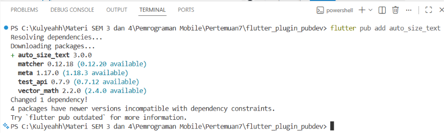
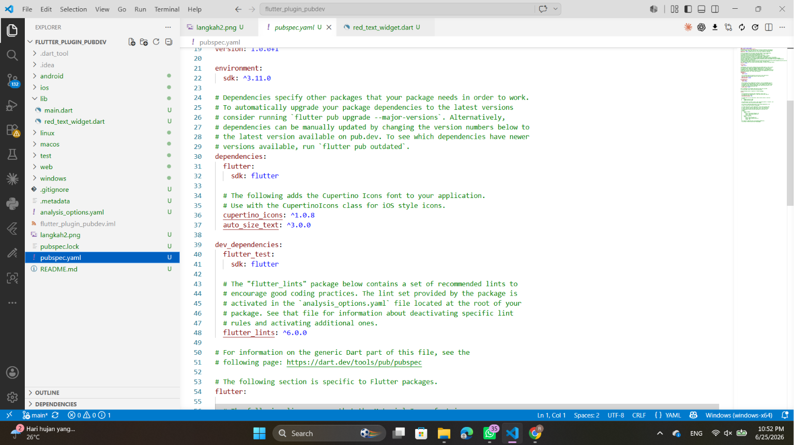

# Praktikum Flutter Plugin Pub.dev





## 1. Jelaskan maksud dari langkah 2 pada praktikum tersebut!

Pada langkah 2 dilakukan penambahan plugin **auto_size_text** ke dalam project Flutter menggunakan perintah:

```bash
flutter pub add auto_size_text
```

Perintah tersebut berfungsi untuk mengunduh dan memasang package **auto_size_text** dari repository Pub.dev ke dalam project. Setelah berhasil ditambahkan, package akan tercatat pada file `pubspec.yaml` di bagian `dependencies`.

Plugin `auto_size_text` digunakan untuk menyesuaikan ukuran teks secara otomatis agar tetap muat pada area yang tersedia tanpa menyebabkan overflow.

---

## 2. Jelaskan maksud dari langkah 5 pada praktikum tersebut!

Pada langkah 5 ditambahkan variabel dan constructor sebagai berikut:

```dart
final String text;

const RedTextWidget({
  Key? key,
  required this.text,
}) : super(key: key);
```

Penjelasan:

- `final String text;` digunakan untuk menyimpan nilai teks yang akan ditampilkan oleh widget.
- Keyword `final` membuat nilai tersebut tidak dapat diubah setelah objek dibuat.
- `required this.text` berarti parameter `text` wajib diberikan saat membuat objek `RedTextWidget`.
- Constructor digunakan untuk menerima nilai dari luar widget sehingga widget dapat digunakan kembali dengan teks yang berbeda-beda.

Contoh penggunaan:

```dart
const RedTextWidget(
  text: 'Hello Flutter',
)
```

Dengan demikian widget menjadi lebih fleksibel dan reusable.

---

## 3. Pada langkah 6 terdapat dua widget yang ditambahkan, jelaskan fungsi dan perbedaannya!

### Widget Pertama

```dart
Container(
  color: Colors.yellowAccent,
  width: 50,
  child: const RedTextWidget(
    text: 'You have pushed the button this many times:',
  ),
)
```

Fungsinya:
- Menampilkan teks menggunakan widget `RedTextWidget`.
- Di dalamnya menggunakan plugin `AutoSizeText`.
- Teks akan menyesuaikan ukuran secara otomatis agar tetap muat dalam lebar container.

### Widget Kedua

```dart
Container(
  color: Colors.greenAccent,
  width: 100,
  child: const Text(
    'You have pushed the button this many times:',
  ),
)
```

Fungsinya:
- Menampilkan teks menggunakan widget bawaan Flutter yaitu `Text`.
- Ukuran teks tidak berubah secara otomatis.

### Perbedaannya

| RedTextWidget (AutoSizeText) | Text Biasa |
|------------------------------|------------|
| Ukuran teks menyesuaikan area yang tersedia | Ukuran teks tetap |
| Mengurangi risiko overflow | Bisa terjadi overflow |
| Cocok untuk tampilan responsif | Cocok untuk teks dengan ukuran tetap |
| Menggunakan plugin tambahan | Widget bawaan Flutter |

---

## 4. Jelaskan maksud tiap parameter pada AutoSizeText!

Kode yang digunakan:

```dart
AutoSizeText(
  text,
  style: const TextStyle(
    color: Colors.red,
    fontSize: 14,
  ),
  maxLines: 2,
  overflow: TextOverflow.ellipsis,
)
```

### text

```dart
text
```

Berisi teks yang akan ditampilkan pada widget.

### style

```dart
style: const TextStyle(
  color: Colors.red,
  fontSize: 14,
)
```

Digunakan untuk mengatur tampilan teks.

Keterangan:
- `color: Colors.red` → warna teks merah.
- `fontSize: 14` → ukuran font awal 14 pixel.

### maxLines

```dart
maxLines: 2
```

Menentukan jumlah maksimum baris yang dapat digunakan untuk menampilkan teks.

Pada contoh ini teks hanya boleh ditampilkan maksimal 2 baris.

### overflow

```dart
overflow: TextOverflow.ellipsis
```

Menentukan perilaku ketika teks masih tidak muat setelah proses penyesuaian ukuran.

`TextOverflow.ellipsis` akan menampilkan tanda titik tiga (`...`) pada akhir teks.

Contoh:

```text
You have pushed the button this...
```

---

## 5. Mengapa pada Langkah 4 muncul error?

Error muncul karena widget `AutoSizeText` dan variabel `text` belum dikenali oleh program.

Penyebabnya:
1. Package `auto_size_text` belum di-import.
2. Variabel `text` belum dideklarasikan.
3. Constructor belum menerima parameter `text`.

Perbaikan dilakukan dengan menambahkan:

```dart
import 'package:auto_size_text/auto_size_text.dart';

final String text;

const RedTextWidget({
  Key? key,
  required this.text,
}) : super(key: key);
```

Sehingga `AutoSizeText(text, ...)` dapat menggunakan nilai teks yang dikirim saat widget dipanggil.

---

## Kesimpulan

Plugin `auto_size_text` membantu membuat tampilan teks menjadi lebih responsif dengan menyesuaikan ukuran huruf secara otomatis terhadap ruang yang tersedia. Penggunaan plugin ini dapat mencegah terjadinya overflow dan meningkatkan kualitas tampilan aplikasi Flutter pada berbagai ukuran layar.

