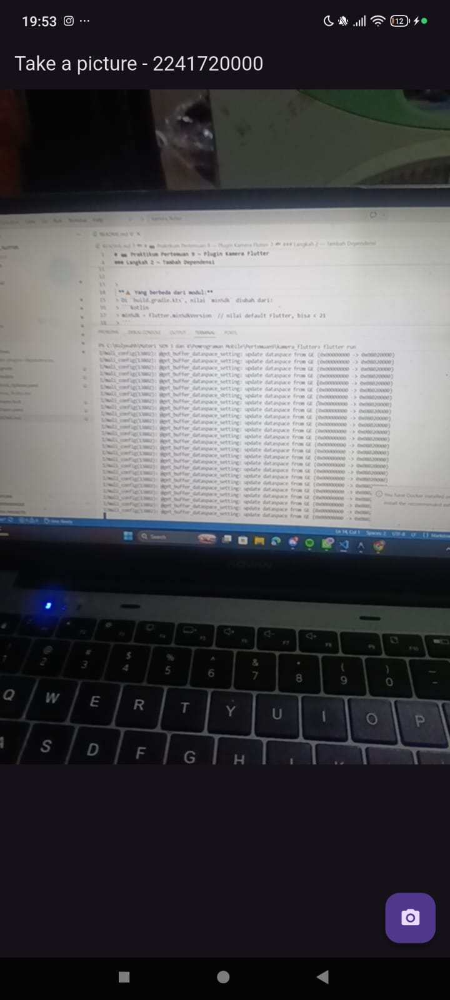
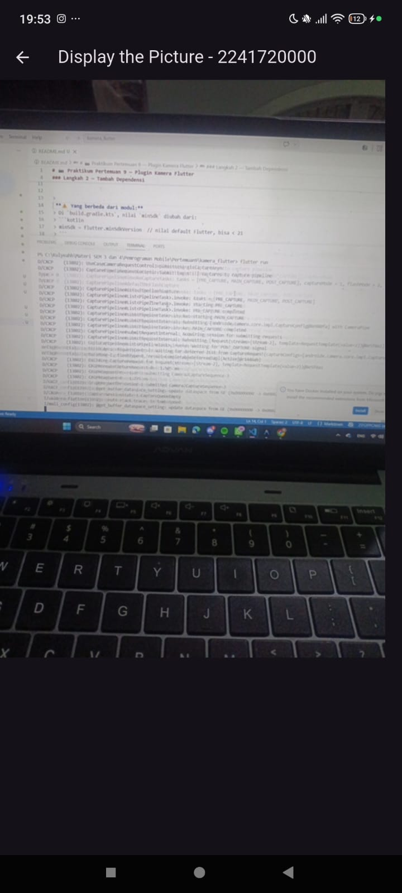
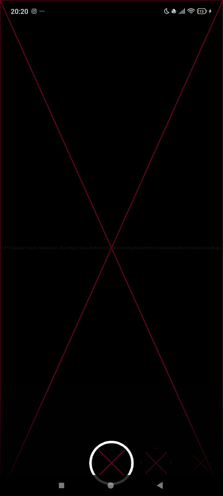
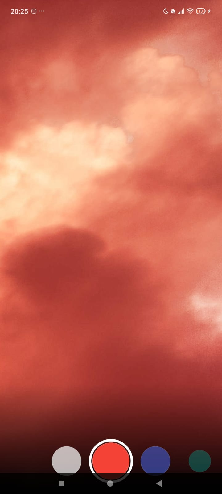
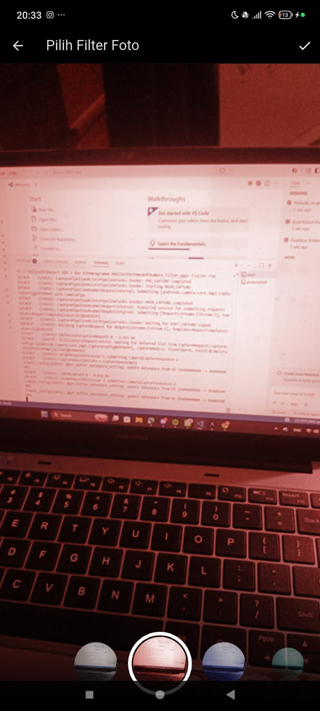

# Laporan Praktikum Pertemuan 9 - Kamera & Photo Filter Carousel

Rachmad Zaki Setyawan  
244107060107
SIB 2D

## Praktikum 1 — Kamera Flutter

### Langkah 1: Buat Project Baru
Buat project flutter baru dengan nama `kamera_flutter`. Ini jadi pondasi aplikasi kamera kita.

### Langkah 2: Tambah Dependensi
Tambahkan 3 package yang dibutuhkan: `camera` (untuk akses kamera), `path_provider` (untuk lokasi penyimpanan foto), dan `path` (untuk bikin path yang support semua platform). Jalankan perintah `flutter pub add camera path_provider path` di terminal. Jangan lupa update `minSdkVersion = 21` di file gradle untuk Android.

### Langkah 3: Ambil Sensor Kamera dari Device
Di langkah ini kita ubah fungsi `main()` jadi async supaya bisa pakai `await`. Kita panggil `availableCameras()` buat dapetin daftar kamera yang ada di HP, terus ambil kamera pertama (biasanya kamera belakang). `WidgetsFlutterBinding.ensureInitialized()` wajib dipanggil duluan sebelum pakai plugin kamera.

### Langkah 4: Buat dan Inisialisasi CameraController
Buat file baru `takepicture_screen.dart` di folder `widget`. Di sini kita bikin `StatefulWidget` yang punya `CameraController` — ini objek yang nyambungin app kita ke kamera HP. Controller ini di-init di `initState()` dan di-dispose di `dispose()` biar gak bocor memorinya. `late` artinya variabelnya bakal diisi nanti pas `initState`, bukan langsung di awal.

### Langkah 5: Tampilkan Preview Kamera
Isi method `build()` yang tadinya cuma return `Container()` kosong jadi `Scaffold` dengan `FutureBuilder`. `FutureBuilder` tugasnya nunggu kamera selesai loading — kalau udah siap, tampilkan `CameraPreview` (live feed kamera). Kalau belum, tampilkan loading spinner dulu.

### Langkah 6: Ambil Foto
Tambahkan `FloatingActionButton` dengan ikon kamera. Pas tombol ditekan, panggil `_controller.takePicture()` yang bakal ngambil foto dan return objek `XFile` berisi path file fotonya. Dibungkus try/catch buat jaga-jaga kalau ada error.

### Langkah 7: Buat Widget DisplayPictureScreen
Buat file baru `displaypicture_screen.dart` di folder `widget`. Widget ini simpel — cuma nerima path foto terus nampilin fotonya pakai `Image.file()`. Pakai `StatelessWidget` karena gak ada state yang berubah, cuma nampil gambar doang.

### Langkah 8: Edit main.dart
Tambahkan `runApp()` di fungsi `main` supaya app jalan dengan `TakePictureScreen` sebagai halaman utama. Pakai `ThemeData.dark()` biar tema gelap cocok buat aplikasi kamera.

### Langkah 9: Menampilkan Hasil Foto
Update blok try/catch di tombol kamera — setelah foto diambil, langsung navigasi ke `DisplayPictureScreen` pakai `Navigator.push()`. Ditambahkan pengecekan `context.mounted` buat mastiin widget masih ada setelah proses async selesai, biar gak error.

### Output

## Praktikum 2 — Photo Filter Carousel

### Langkah 1: Buat Project Baru
Buat project flutter baru dengan nama `photo_filter_carousel`.

### Langkah 2: Buat Widget Selector Ring dan Dark Gradient
Buat file `filter_selector.dart` di folder `widget`. Widget `FilterSelector` ini yang bikin carousel filter bisa di-scroll horizontal. Di dalamnya ada 3 komponen utama: gradient gelap di bagian bawah (biar filter keliatan kontras), carousel filter yang bisa di-geser, dan ring putih di tengah sebagai penanda filter yang aktif. Pakai `PageController` dengan `viewportFraction` supaya 5 filter keliatan sekaligus di layar.

### Langkah 3: Buat Widget Photo Filter Carousel
Buat file `filter_carousel.dart`. Widget `PhotoFilterCarousel` ini yang jadi halaman utama — nampilin foto full screen dengan filter carousel di bawahnya. Pakai `Stack` biar foto dan carousel numpuk. Filter disimpan pakai `ValueNotifier` supaya cuma bagian foto yang ke-rebuild pas ganti filter, gak seluruh layar.

### Langkah 4: Membuat Filter Warna - Bagian 1 (CarouselFlowDelegate)
Buat file `carousel_flowdelegate.dart`. Ini "otaknya" carousel — ngatur posisi, ukuran, dan transparansi tiap item filter. Filter yang di tengah ukurannya paling besar dan paling terang, makin ke pinggir makin kecil dan transparan. Pakai `Matrix4` buat transform posisi dan skala.

### Langkah 5: Membuat Filter Warna (FilterItem)
Buat file `filter_item.dart`. Widget simpel buat tiap bulatan filter di carousel. Nampilin gambar tekstur dari internet yang diwarnai sesuai filter. Pakai `ClipOval` biar bentuknya lingkaran dan `GestureDetector` biar bisa di-tap.

### Langkah 6: Implementasi Filter Carousel
Hubungkan `PhotoFilterCarousel` ke `main.dart` sebagai halaman utama. Gak perlu async karena praktikum 2 gak akses hardware kamera.

**Troubleshoot:** Pastikan import `dart:math as math`, `package:flutter/material.dart`, dan `package:flutter/rendering.dart show ViewportOffset` sudah ditambahkan di file yang butuh.

### Error yang Ditemukan & Perbaikannya

Saat pertama kali dijalankan di HP, aplikasi praktikum 2 menampilkan **silang merah (X)** di seluruh layar. Ada 3 penyebab error:

**1. URL gambar dari Flutter docs sudah mati (404)**
Kode asli praktikum menggunakan `Image.network()` dengan URL `https://docs.flutter.dev/cookbook/img-files/effects/instagram-buttons/millennial-dude.jpg` dan `millennial-texture.jpg`. URL ini ternyata sudah tidak bisa diakses lagi (server Flutter sudah menghapus/memindahkan file-file tersebut), sehingga gambar gagal dimuat dan muncul ikon silang merah.

**Solusi:** Untuk foto utama di `filter_carousel.dart`, URL diganti ke `https://picsum.photos/800/1200` (layanan placeholder gambar yang reliable) dan ditambahkan `loadingBuilder` serta `errorBuilder` supaya kalau gambar gagal dimuat, tampil ikon placeholder bukan silang merah. Untuk filter item (`filter_item.dart`), gambar network diganti dengan `DecoratedBox` berisi lingkaran warna — lebih simpel, gak tergantung internet, dan justru lebih jelas menunjukkan warna filternya.

**2. Method `withOpacity()` sudah deprecated**
Di Flutter versi terbaru, method `color.withOpacity(0.5)` sudah deprecated dan menyebabkan warning. Harus diganti dengan `color.withValues(alpha: 0.5)`.

**3. Method `translate()` pada Matrix4 bermasalah**
Di `carousel_flowdelegate.dart`, kode asli menggunakan `..translate(x)` yang bisa menyebabkan type error karena method `translate` punya beberapa overload yang membingungkan. Diganti dengan `..multiply(Matrix4.translationValues(x, 0, 0))` yang lebih eksplisit dan aman.

### Output

## Tugas

### Gabungan Praktikum 1 & 2 (`kamera_filter_app`)

Project `kamera_filter_app` menggabungkan kedua praktikum. Alurnya: user buka app → tampil layar kamera → ambil foto → langsung masuk ke layar filter carousel → pilih filter warna buat foto yang barusan diambil.

Perbedaan utamanya, setelah foto diambil, navigasinya diarahkan ke `PhotoFilterScreen` (bukan `DisplayPictureScreen`). Di `PhotoFilterScreen`, foto ditampilkan dari file lokal (bukan dari URL internet seperti di praktikum 2 asli), dan carousel filter ditaruh di bagian bawah layar.

Semua perbaikan error dari praktikum 2 (URL gambar mati, `withOpacity` deprecated, dan `Matrix4.translate` bermasalah) juga sudah diterapkan di project gabungan ini. Bedanya, di `kamera_filter_app` filter item menampilkan thumbnail dari foto yang diambil kamera (bukan gambar dari internet), jadi masalah URL mati tidak terjadi untuk foto utama — tapi fallback-nya tetap diganti dari network image ke lingkaran warna untuk jaga-jaga.

Struktur filenya:
- `main.dart` — Entry point, init kamera
- `takepicture_screen.dart` — Layar kamera
- `photo_filter_screen.dart` — Layar filter (gabungan praktikum 1 & 2)
- `filter_selector.dart` — Carousel selector
- `filter_item.dart` — Item filter individual
- `carousel_flowdelegate.dart` — Custom layout carousel

### Output

### Jelaskan maksud `void async` pada Praktikum 1?

Fungsi `main()` diubah dari `void main()` jadi `Future<void> main() async` karena kita butuh `await` untuk nunggu proses `availableCameras()` selesai. Proses ini ngakses hardware kamera HP yang butuh waktu, jadi gak bisa langsung dapet hasilnya. Dengan `async`, program bakal nunggu dulu sampai daftar kameranya didapat, baru lanjut jalankan `runApp()`.

### Jelaskan fungsi dari anotasi `@immutable` dan `@override`?

**`@immutable`** — Penanda bahwa semua properti di class itu harus `final` (gak bisa diubah setelah dibuat). Ini best practice buat widget Flutter supaya widgetnya aman dan gak berubah-ubah sembarangan. Kalau ada field yang bukan `final`, Dart bakal kasih warning.

**`@override`** — Penanda bahwa method itu menimpa method dari parent class-nya. Contohnya `build()`, `initState()`, `dispose()` itu asalnya dari class `State`. Gunanya biar jelas bahwa kita lagi nge-replace method bawaan, dan kalau typo nama methodnya, compiler bakal kasih error.
